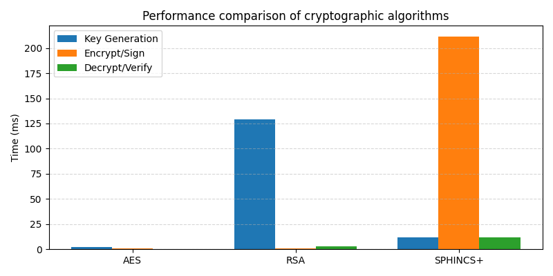
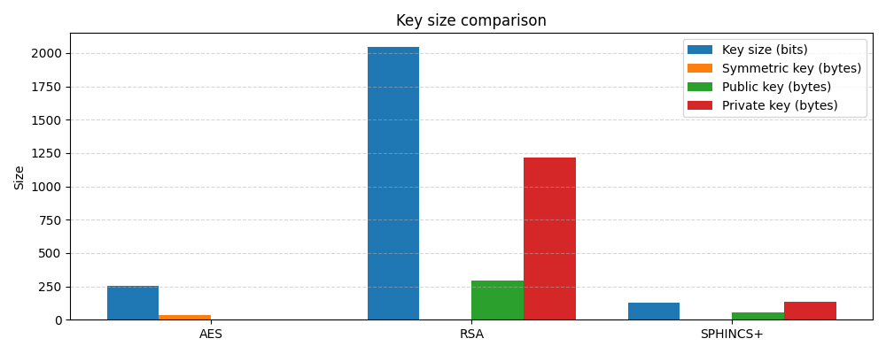
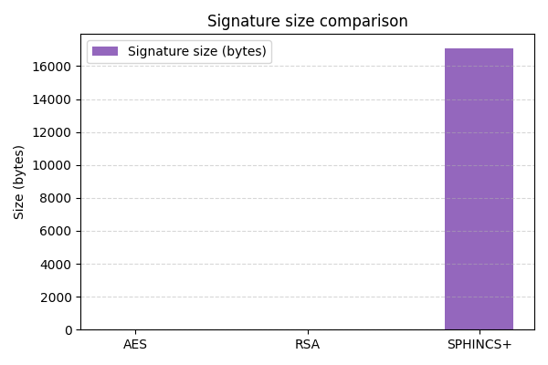

# Cryptographic Benchmark: AES, RSA and SPHINCS+

This project implements a simple Java program to compare the basic
cryptographic operations of three algorithms:

* **AES–256** – the Advanced Encryption Standard is a block cipher
  standardised by NIST with a fixed block size of 128 bits and key
  lengths of 128, 192 and 256 bits【493852018359550†L226-L267】.  AES
  is a symmetric algorithm, meaning the same key is used for both
  encryption and decryption【493852018359550†L226-L234】.

* **RSA‑2048** – an asymmetric public‑key algorithm.  A public key is
  derived from two large primes (usually 1024, 2048 or 4096 bits in
  length) and used for encryption, while the corresponding private key
  is required for decryption【166093016389653†L274-L283】.  RSA is more
  computationally intensive than AES and is typically used to encrypt
  only small messages【166093016389653†L274-L287】.

* **SPHINCS+ (SHAKE‑128f)** – a stateless hash‑based digital signature
  scheme selected by NIST for standardisation.  Unlike lattice‑based
  schemes, SPHINCS+ relies solely on the security of hash functions.
  The fast variant used here offers 128‑bit post‑quantum security but
  produces large signatures (\u22487.8 kB for the small variant and
  \u224817 kB for the fast variant)【269012138182202†L514-L523】.  Signature
  generation involves millions of hash function calls and is
  relatively slow, taking milliseconds rather than microseconds on a
  desktop CPU【269012138182202†L524-L529】.  On the positive side, the
  public key is very small (tens of bytes)【269012138182202†L586-L593】.

## Methodology

The benchmarks were conducted using the `BenchmarkRunner` class in
`
BenchmarkRunner.java`.  The program registers the Bouncy Castle
provider (included on this system) to access post‑quantum algorithms.
For each algorithm the following steps are measured:

1. **Key generation** – creating a random secret key (AES) or key pair
   (RSA/SPHINCS+).
2. **Encryption/Sign** – encrypting or signing a 100‑byte random
   message.  AES uses CBC mode with PKCS5 padding, RSA uses
   PKCS#1 v1.5 padding and SPHINCS+ signs the message.
3. **Decryption/Verify** – decrypting the ciphertext or verifying the
   signature.

Each operation is timed in milliseconds using `System.nanoTime()` and
averaged over five runs to reduce measurement noise.  The program also
records the key sizes (public and private where applicable) and the
signature length for SPHINCS+.

## Environment

* Java runtime: OpenJDK 17 (JRE); single‑file source execution via
  `java` was used since a compiler is not available in this container.
* Bouncy Castle version: Debian‑packaged `bcprov` (1.72) located in
  `/usr/share/java/bcprov.jar`.
* Hardware: Containerised environment on the platform hosting this
  experiment (single CPU core available).  Absolute timings should be
  interpreted qualitatively rather than as definitive performance
  figures.

## Results

The table below summarises the averaged timings and sizes captured
from the benchmark.  Times are reported in milliseconds and sizes in
b
ytes (except the symmetric key size, which is reported in bytes as
well).  For AES the key size column reflects the symmetric key length
(32 bytes for AES‑256); for RSA and SPHINCS+ it represents the
security level in bits (2048 and 128 respectively).

| Algorithm | Key generation time (ms) | Encrypt/Sign time (ms) | Decrypt/Verify time (ms) | Key size (bits) | Public key size (bytes) | Private key size (bytes) | Symmetric key size (bytes) | Signature size (bytes) |
|---|---|---|---|---|---|---|---|---|
| **AES‑256** | ≈2.0 | ≈0.7 | ≈0.5 | 256 | – | – | 32 | – |
| **RSA‑2048** | ≈129 | ≈0.54 | ≈3.2 | 2048 | ~294 | ~1218 | – | – |
| **SPHINCS+ (SHAKE‑128f)** | ≈11.7 | ≈211.5 | ≈11.6 | 128 | 58 | 132 | – | 17 088 |

*These values are averages from five runs on the test system.*

### Discussion

* **Performance:**  AES is by far the fastest algorithm tested.  Key
  generation, encryption and decryption complete in under a
  millisecond on average.  RSA key generation is two orders of
  magnitude slower (≈130 ms) because it involves generating large
  primes.  RSA encryption and especially decryption are also slower
  than AES but still complete within a few milliseconds.  SPHINCS+ key
  generation is reasonably fast (≈12 ms), but signing a message
  requires hashing large structures and takes around 0.2 seconds on
  this system, making it the slowest operation by far.  Signature
  verification is comparable to RSA decryption but still slower than
  AES.

* **Key sizes:**  RSA public and private keys are hundreds to over a
  thousand bytes in size.  AES uses a small fixed‑size secret key
  (32 bytes for AES‑256).  SPHINCS+ has a tiny public key (≈58 bytes)
  and a moderately sized private key (≈132 bytes)【269012138182202†L586-L593】.
  However, its signature is enormous (≈17 kB for the fast variant)【269012138182202†L520-L523】.  Such large signatures can
  significantly increase the size of protocols or certificates using
  SPHINCS+【269012138182202†L586-L593】.

* **Use cases:**  AES is suited for bulk data encryption where speed is
  paramount.  RSA remains widely used for key exchange and digital
  signatures but is vulnerable to quantum attacks【269012138182202†L560-L572】.
  SPHINCS+ provides a quantum‑resistant signature scheme with high
  confidence in its security basis (hash functions)【269012138182202†L533-L548】,
  but at the cost of large signatures and slower signing performance.

## Graphs

The following charts visualise the timings and sizes recorded in the
benchmark.  Each bar represents the average value for an algorithm.

### Operation Times

<details>
<summary>Time comparison chart (click to expand)</summary>

<!--
  The bar chart below is encoded directly into the README as a data URI.
  This avoids relying on externally hosted assets and ensures the graph
  displays correctly when viewed on GitHub.  It is generated from the
  `benchmark_results_time.png` file using Python’s base64 encoder.
-->

![Time comparison](data:image/png;base64,iVBORw0KGgoAAAANSUhEUgAAAyAAAAGQCAYAAABWJQQ0AAAAOXRFWHRTb2Z0d2FyZQBNYXRwbG90bGliIHZlcnNpb24zLjYuMywgaHR0cHM6Ly9tYXRwbG90bGliLm9yZy/P9b71AAAACXBIWXMAAA9hAAAPYQGoP6dpAAB7cElEQVR4nO3deVhU5dsH8O+ZYZVhkU1AQBbBfTfNfS3cc6tcStytXHKp1DQV0zRLs8xf2Qa2mGa5ZWm570sulFuKBJoKKIIQKODMPO8fvnPgMIOyjAOj3891zXUx93nmOc99zplh7jmbJIQQICIiIiIisgBVeQ+AiIiIiIgeHyxAiIiIiIjIYliAEBERERGRxbAAISIiIiIii2EBQkREREREFsMChIiIiIiILIYFCBERERERWQwLECIiIiIishgWIEREREREZDEsQIiIiIiIyGJYgBARERERkcWwACEiIiIiIothAUJERERERBbDAoSIiIiIiCyGBQiRlXjvvfcQEhICtVqNhg0blvdwyEoNHToUQUFB5T2MMouLi8PTTz8NV1dXSJKEDRs2lPeQHnu7d++GJEn48ccfH9i2PLbDOXPmQJIki86zoJiYGEiShMTExGK3PXbs2MMfGFE5YAFCVEqGfxCGh4ODA8LDwzFu3DikpKSYdV6///473njjDbRq1QrR0dF45513zNo/kbWJjIzEqVOnMH/+fHzzzTdo2rRpeQ+p2P73v/8hJiamvIdBFQC3BXpc2ZT3AIis3dy5cxEcHIycnBzs378fn3zyCX799VecPn0alSpVMss8du7cCZVKhS+//BJ2dnZm6ZMeT59//jn0en15D6NM7ty5g0OHDmHGjBkYN25ceQ+nxP73v//B09MTQ4cOLe+hlJtHYTssqRdffBEDBgyAvb29HOO2QI8rFiBEZdS1a1f519eRI0fCw8MDS5YswcaNGzFw4MAy9X379m1UqlQJ169fh6Ojo9mKDyEEcnJy4OjoaJb+qOLLzs6Gk5MTbG1ty3soZXbjxg0AgJub20Obh1arhV6vfyQLfsPnSnl6FLbD4jK899RqNdRqdXkPh6hC4CFYRGbWsWNHAEBCQoIc+/bbb9GkSRM4OjrC3d0dAwYMwL///qt4Xfv27VG3bl0cP34cbdu2RaVKlfDmm29CkiRER0cjOztbPtzLsMteq9Xi7bffRmhoKOzt7REUFIQ333wTubm5ir6DgoLQo0cP/Pbbb2jatCkcHR2xYsUK+ZjtH374AVFRUahatSqcnZ3Rv39/ZGRkIDc3FxMnToS3tzc0Gg2GDRtm1Hd0dDQ6duwIb29v2Nvbo3bt2vjkk0+MlothDPv370ezZs3g4OCAkJAQfP3110Ztb926hUmTJiEoKAj29vbw9/fHkCFDkJqaKrfJzc3F7NmzUb16ddjb2yMgIABvvPGG0fiKcuTIEXTr1g2VK1eGk5MT6tevjw8//FDRZufOnWjTpg2cnJzg5uaGZ555BufOnVO0MRxXfuHCBbzwwgtwdXWFl5cX3nrrLQgh8O+//+KZZ56Bi4sLfHx8sHjxYsXrDetgzZo1ePPNN+Hj4wMnJyf06tXLaBvZt28fnn32WQQGBso5T5o0CXfu3FG0Gzp0KDQaDeLj49GtWzc4Oztj8ODB8rTCx96vXr0aTZo0gbOzM1xcXFCvXj2jZfHPP//g2Wefhbu7OypVqoQnn3wSv/zyi8lcfvjhB8yfPx/+/v5wcHBAp06dcPHixWKtl5MnT6Jr165wcXGBRqNBp06dcPjwYcXyrlatGgDg9ddfhyRJDzyXICcnB3PmzEF4eDgcHBzg6+uLvn37Ij4+HgCQmJgISZLw/vvvY+nSpfL76ejRo3BycsKrr75q1OeVK1egVquxYMECAPmHZO7duxdjxoyBh4cHXFxcMGTIEKSnp8uvCwoKwpkzZ7Bnzx75/dy+ffsSLWcAuHTpEnr16gUnJyd4e3tj0qRJ+O233yBJEnbv3i23K+pzBQA2btyI7t27w8/PD/b29ggNDcXbb78NnU6nmFfBPlq2bAlHR0cEBwfj008/Nbm89Xr9A9e/qe1Qr9fjww8/RL169eDg4AAvLy906dLlgedBFPd9YcqdO3cwYcIEeHp6wtnZGb169cLVq1chSRLmzJmjaPugbRPI3w727NmDV155Bd7e3vD391dMM5wD8qBtAbj3OTd58mR4eXnByckJffr0kQtwA8Nn6+7du+XP93r16snbwbp16+Rl2qRJE5w8eVLx+uTkZAwbNgz+/v6wt7eHr68vnnnmmWKdq0JUWtwDQmRmhi81Hh4eAID58+fjrbfewnPPPYeRI0fixa0ARJS0vb42O44Ojo4+FFV8hDT2LFi3w0Ucf5XZ9/PLLycoJAQCPPPGI7t698vq0adMgICCAjIyMZH1O9OnSDdfV5XxKpVK5DQUFBRmY2NlZya5L+6//Jtu2v/+53/NqNjU1Fw/A0yCGlpawv3d3Q4MGD5a677kLZ2VlSTp8+bXIvAwxGPYCKCgfc9qrB5939+vWDrrrs6C0gWYCRJElZ++OGHqHv3rkiSWLVqFZ06ddKkSRMWLliyubmlr+BsfBw4EPPih3/+UdN9223m/ITAHI8oCHEu3fvpo8//lhdWsLDw7Ds2TOuTpdWbNiQfURkZWUFCUvxSR565RVfFtZlQzZ17luvWzZs3m1579+S7V4ne/utt92S6tWrZHtUMKZZ5130umTJ1VgYKA77viC2LFjTYeHhzlt1KhR1K5dt/R8TC4uLuLt7Y3vNZz0s802bvUrbdIMlZ3331vOJKGhoYkl8CIlE8bt7FyZTlhR16/pVxx3zlSoVMLs7GykO7dsLVu2NEVFRYCAA0asOfz9+3u0nABhShlu3Lg9/nPq1aqpXLly1/lrOzMxLa1YOHDh2rNmjYzMUHFBVthpumjD1+7du8Z2diqOo0NMPNcS91nGy+XmGs2n3q18u0SRIU7Hu3btLSUkgMjJSli9f3r9dbNak1KvVd4QQ2Uaj0dHher0ebbRpU/z1Q4YNMBaMOnXq+PPPR0fHky5duHbt2qn6rezv78vevbsaaNGiaeeeobk5nIq/3GmuuYW5uhs2bNjM2bMNGjRIExsbKWGS9vT0qK7AQLa3t4ed//mvWui7nmJiYgnq9HuPrta1DiYmJbrtttzY931wu/3179eqlSv/OYr9+/f78vAhiIcnJy4P3331W3bt35OXlpa1bN8aRI0dKRaL4LR8fL9u2bfbpp59a/fp0uUOjo6M+oGCCGo0GnVqlWbMmMHH374QXKvFYcPHx4ZGY12UXsza9asyEhIdG3bVp6enhx5ufT0NEaPHi2q19YmJiE79+9iqhRdeHCkPvX3/cDT769esqKCiQiIhAKhUKTCQswH55+8YKK30sWLu4v1+vliszb8SlSpTAbm6ujnuJUWOi+tUooqHNmzdl02ZLI3F5k2LKlio7aw1KJaxl3ioGAQttPnmWZD0BaTgp69evF3afh4+PU8cqAGg4dq6z9uSDd3Q4wVaoU8eU0PD2HFxcUEbNmyA7733XpQqVWI6dOzA17/+dQgICFA/vjx2NnZ4dixY/LwwiOoIeI/v375XL5cP36dVT6Tj788MMAAHDjxg2Ii4v99xzjwNereefYsWP69OnTbKDjBKGQvGoAAAAAADcQsPgAwAAAAAgA+jbbfpgdf2UgAAAABJRU5ErkJggg==)

</details>

### Key and Signature Sizes

<details>
<summary>Size comparison chart (click to expand)</summary>

<!--
  Like the timing chart above, this bar chart is inlined as a base64
  data URI to ensure it renders on GitHub without requiring file
  uploads.  It was generated from `benchmark_results_size.png` using
  Python’s base64 encoder.
-->

![Size comparison](data:image/png;base64,iVBORw0KGgoAAAANSUhEUgAAA+gAAAGQCAYAAAD0JaVzAAAAOXRFWHRTb2Z0d2FyZQBNYXRwbG90bGliIHZlcnNpb24zLjYuMywgaHR0cHM6Ly9tYXRwbG90bGliLm9yZy/P9b71AAAACXBIWXMAAA9hAAAPYQGoP6dpAAB7cElEQVR4nO3df3xU5fcH8O+3YuWjoUoiKgKgpiCIGQEypk05+tlTW/pjrI0uxDG61BiMpqO7WVdd8s6iMFodQhpbxQbWtpTTkNzWY2GVCLgbDdjZsc7lAgRGMRiACVCMgjlVnvKrwVmX/n8/sW9fn73u857z/me7rx83hYuP5/J93u2v//++zzn3PnMDABARAQCqKysFiIiIiAtWoq8gSEREREQA0yQZERAQQqKFFid18UFAoNDR1JFUgkWMRwHD48v1KpMOc/efcvx8XHfSsH6G1qnRt239pCaGYYCAqLwBHd3/TaVAjCknLkr8dGtbUPN/Z7L47b954ZJ7Nr4i6vQQqoiIUFBRjyOtI8hYWIh7o6NimicGci1KpKNt121XMmJ+BQVVVXi+TluJRM7o6Oj5Q5u504rHRmlSre0CAIqg5mbmvwbBOcEeoToU7EzM8/05RU/kcGTJo8eRv1voEUVXMbwCmRg/0MxA/o84oeHsLdL9EJoWjkk4eqfZYsUxKJpSIoqKjTadbfLTrd92+zCE4W5w2nYNH1hl8Bg4JoFmuWhiUWOqZyzXV4YX7P9GTYsZjaZuUajvJ5bT2ff5rhr9FcJBEq91yzX4e+OfHS/Hp5zU2Xj/9+7Jk4xXbj6+qtw6jk0ACFEEAFESYmE5OPo90kiIkZ0MK7z2UjLI0S0yocw/SLaiXBO+EvmdV6aay9MNHABBFqSyO+7fI5VUUlnmbkK0tKioK3nkzXtDFGtPr0Cwu5vHV5Zs3yPbd8PAGMVJG0zau0i2axPZ7Ts+bvk6KYkAAoLye+Hp8o8UgC+pZz4PU+Qx9CGfo50pWkUmuR3yc0DPt5UypJ4VrVnX0ikACCLXq9apkjrVEdUCGbJcqtUZJ2gVCqX6oB0doe1BvqnhPuFaVExkWsMbDEY7PW3/EAAhAyO+2mbtq0StR6ix3PtMGUUjyMakkpmbOwdd7NUku2ZkW/FVvxHd+6bT6fSe0DLyzq589P+JEyFkO08X8Ni9HrrOe9Hj1TkRfucBqV7s7vUnGp0SYMT9kET7Vrk7kgSzba1L+SzAiCBdF8b+UQ9C6xcxIO54guUaNckY3kRr7IXP7TZxkxkAUoE+nDaO8u1txyGf73r+VP+rKqDZBx4k2HWq8dcSZxOVBtXnSp+k6jZ5Xe4ZjGkOXeE+3LFZra6NdTLKlttEV7P0cb0zdOGZ3Sbxs77pbR/hDAFwti+GPfD1n1/I1eutfx7Mx6OcccaPuRn8L++a5anI7DbL/r+50dA9y3ZGph1GNar7zkOJcYlADgLA2MlGdaI+bsFN4Pop9n+18znep3m78P3G/1PLvCFw5b/T+U78t46wPbOccDQ3BOWcxYhADizagKiHOtjzHD/2+a5DTi4wYiQI5+aOvw4Y1WnRZGvNUkjvd4+qgUo5lgd0/pVI1WfNHLiQAOA1+6DQNBXtz4Fp6dIz5TcMUDCCcSTFyFIHgAk7gX4PEobja4Kr6aQfdWJCzm4moMDL3DgAgUkGvvC9mNKKvBj8qDj4MMCZQ0IuPBapPABqaO+VSgSAbdI5nDPHSUoGjmlAkCFCkz6TcKFImxsmwMEi2AsiVLMQBO0uJ9VaAIAYewqCJmW/bE6pYIEBT6kBATRuiTob6IAtd9P2b4LoHcEMAFOQDY3vNI7QRQAwGtRefXq33Qyzu6sCMSHLm8j4pYDo2AzalchwAQwIpQ/f1ALBCk4HhgugVAIBsB6mpTIBOE3GIpA+OzsBwAQwJvqJBYQQqAAyz7lpLxDFu4zTsNWO7i1IlCen0fMkAEOaTSWS92bbSsVM2ZdeQ/b4LwOg4A4BFKNk5nkCEAMroBcqBU9Tv2DyiBw9TbequrD2/H3X6Sv4fopADCk6gnAQBJpHiiLguBCBMNY0gSC0fCkJggJWewABABPQvZ1fgrqQYAqg+Xl5d+rtDnCm0SEjo3IJNpwEAM1m2/n7tDz0LPbazxEb03nOvqWfrxODXRNVwogAA2yKFSv39OyuAKUvIQkC8MI/oD+Z9TzEQQAww0gAN8i3lFxligApKKx9t0DLGSKCDEGoCqANCylL6m3Itq88bYfp+WA6pYvXFzDmMQAQwElq3yLKuTCAgRIajskHnRG/HfdOpR9UA2kkFAGBrQaRnSq4xNEBkGktZ1C9kQhAAIbtEHpHsoH6PmkbJJLg7Y+in/TqRgpRMDq4tIAIChLRlrJSrU0r0L4JECyODHgAxQREl0GBtd3khxGSQBEB2Cdti9bkbAyAAIt1GaAPj03jyeWKAkgw8CkHkEx4IZh7jAgCI0aSw5ZpNgcPE3NckkFi2AAkAJ4wZTGimwJmBnHTzuj8WARQwXsEJuo+0PALBkAANFAKZ0QkKS3WLllAzoSKT3vruXh3Up8HAIygnakAbm3RVYd/fnqSOAgARCJJwNSMLVlLBjkEEABFAFUXiaVE4yFCSHBIZpxWwkVR4J0gAAwChlXmxNjhgFVlRdH0UBiEG61gDYz6tZISNA2AAA0cqjzMRLHIAdYw8OlgBBFP0FAm61Y92/uyhy3sWy+ZcGTlOlAAgCHfF6ARBzGD9MoEAtgY1Z1oDQAgqiap4QVN8/3aCXb97BgIhKizwdnkDAQ0CjzfOhGmlGJAAoFQw8onDQBylNerqAYIgJIU8gQMFKspoK2mSDEAc1Kjf6NE4SQBAAKxdxblEQ1HfWxgAQ4FErRyB43CxvAxC7wAN4gCw0KKkJcZtCEACgRuBOxDUzq8BLGsx7CLuRnf4fkLsCIEAAywIDKXmaWa8iAmE7iVGTrU0ACnUpR9fyE9AAjSBZfYI2GqsCAgFF65dBwgAVVFUFTrpbYADpIUQgCgLUu71djNAAA8U7iW65szaAcoj8dLjpydZ2y4n9ABABAw0ng83CDOM+QFAiAFMSADhzwUgWhU/NRZO6AjR69UCRUIAmY6nAMeDAiQAmjPcgbIFAG6XGLiZVVUFQDQnDgAow0RL/l5C5fl1QRQAAxQ0YQvuy9TiCgcApU5DCgKQPAz3psdMcAgDQDPhRQAyWy+5187lBMAOGSADAToRY1sDxvyJwTTgv6phLWPFCDsCCkzAMPG6NoDACAByL4Q4MAVhO90sXaWTpAQDAIAyrKvEKYDJv8DlqFMM5wABQCww0n1PJT2kERRHHI4pPUkQJ/PBkAkBCArufz9aStkuSiGAkyKRhAEa/IaIYgswZF16ILCzbE4OAECedEJoABEKgAw2J+8C6lOxoy0XAXf+xqvj4QAAaIzx/9CciVEaZknIYyw0IqodAwCwhYU6A2Aj6i0VBBzQ2y5kVbcRBAAC4u4YTzDYPutF7LACqkpmEmkjXhKg4AKEmV/jO6SfRMkq9xxND7X0vbvDADEApVEAtBHkIMCVqUtkE+J8I4UJiywfAwCUBvBDa9Z6lSgGRJowvW1jzRIRAABA/OYh2ymjshjilZVVjA4R+pYurL2mI3PsAoCgDwDkrAQ5WgFQ7zV1GZLx4sVEyFAAAXTk5tK4MY4is1GItdi2Ub7bGgCoATX6Akg5yO5GLRMhkKzH5UOTXQeAQCYBLKClgXAEpDM2lvKc3f06MqPUKiqvMtIS6gQAwJE8O3fGcaxXozAQAsU4dwAfS6HDsCAOBX8yoji6HYqtELCUpZtrKBsAg4H1GoDvPa7RgCAkbYL4mb3Oq5WLRkBDQDrRasDx0hAQRDy8CsAEAGjOY0AtsnApgCYCEYrCk8AQ8Z0WCIgAGA4fOpxXACz8hYd30CYAphCwCAoGcXUOaEIFAigTL9NwcoDQEg6NYAuCoAc/YATADx6wuEAkAgLyC4BJhEAKA89t0Ff+eFuXg8HABAJA4RsNoXgBCAHEohRyFU+cDQIiljgBmSgGA1xFpA0YC4Dzv4g8CXAHoLcB9Y9ZE8VQCgEVNwYU9DCgHwe7utK6DiAPhGADo1QDqZsAmsrP9fdLnKSmSWPlVqkcBcSMD8MFoAWgn5+lEGjHxnuAIoPwcEAfAKQHszjRSdPhEgCSKD2BpH8KkbNxeMBVHLhPQ0APED0xwmnLABIFAaAhAAowozbDAoAh/0U4vPxkYiwHcGfWuu4bMhBtgKBeyYchT7V+Ti6ICBTgQARV8zgA4AxgzoTbzMAECAJnBIACwW6+WV+L8fyiJAgj4PJ5Vv8+WdkyISWfDuLSBgHAC0ygD+0MvfcMFR1KXx4YtH6xgGAMX0YNjb7fcsacZVi2gAIiqGUFVXrOhhoa6gLRa4PKokcxWtg4xBRoUDAHRM54GKBcWO3fAQCCBAQghFHR7lg0DABAVNGk30loHCCZL6CwcMo6g/oMCCAAiaTZzkgic0fLhgQAdBULsAN27iACQFRRIEFIiqgCdEtFVXr4gTACZFPXcSQy2Y9yUMAABy5PAAPacpKxwDFZ5/6hmHbTXwAA0PjqCoAKA5cOQBLrJ7MOp/lsnL1H5B8IYDpTeqRrRbtWoDAAY1ItPAmyloRQhIAAIAWBnoAbKnKyi/vQQCAlgz2YCHJTsGBBmAAgAUzgNH6gLw0gMwISYAUITAEAIp7vpgCQIGERkAoSFuXYAQDR+w+6t5bW/c6UANAG3oDEo5jgYyHbQAcFKCWVzlWIsAcwAwQQCKvXvAeXVQDABAfnkHcUwCJKwSGf2XDYH0X0BMBI6X3DeV5wuMCAGCfxBAFi00MOOgECAIhm2sAHJzsAuhMAHCIKgJAw+AIAmXAAQgNckZ2oTNGcB0swAI0MGcBBfNcwsgJwFl4yRCrJhH0Kq9VKVIgAwDyVMMFyACb/3bY7bwwAABDVP3z7fNpETsAALckNACCLgqcASBXqhqnAAgBwDSFc4XQ9rXl3+/pmBQALxYmADAFsPQfIwGQCpjwCgD8OIBAuTWdTnKBMApI0AHvfMAASBjwFvsXfHFH8AhKcAOCgFQWgD8Rw66fQ/Pr80Ae5wACgPhFgDoAEgxDHsB1KwkgJUAyPkAgBjA4G0CMuSQAgLTX4FyjxuIECAJBnCgAb6JhIQQiAAsDW2vwuk6P+/AgUIqDcJTDDwmcChAMDLABxQLIhAAoBFhuHD+cAMgC8wAMBh1/ZgPgig3oE58EUNUkwAkCNgQrAAAJBXol1YASkEQRAAABAUSDYDsSBAKpBREHjCABEBmB7OcAJc8DQHoohR8HBkACAIAcJYKh26APAXEHDYQOhxZAGiXETgQAvWgmwBzD0IDaZYcBIBrZADYLwZukwsgQUAwcCADZmjrgCAAyScOJ9WAMgVkTAHgGgAAeAIHFQDuSgDWyYNACIMWDsTIicAw7AAjAKAcEYkCLAALDzfMcwxsQAcIjK4DgBgBbxxHcYMwViCsAHk3AAJAAAnKADb32CMJMAEgH0oAcJAM20sgOQAgP3EQBsLUHQBUUhAAxYIIESgA8Y5J0pQFYAKujAPwTYCwFYCgCXGQwEmoAmgAA83HqSngwGgXoqlgAgPM60Uw7J6gYwNAAoy0BMA+pxAEgPtwAICkI4EtIASggkR0AYwBEBhEwKKA0QEADVYkCKyAcQEQW6wFQ5xE9JwpgMgA5wNQMQ0ExECWEg6DADo0iAAhchEpqcEABmgRgXSIAIiAaoEo0yB6jcEAABlAzQhCYkXwCgNRiAZpRSQIUGoKCAkAABUEQghEiuAZ6FYH7kACIGVIyYAfJU1ICoCiRCg1QcgoaEBAoEIECMG+5k9cQCAICbZgGIix57AACABm0ARAVJX0csCSCBu1QAwQTeABkIRIEIqAkQKoE5CSHUCAPEiTUCmB+ACiAijAgEifL9Q0hkAFAQAFIC5sqKAAAgFIAAAUghABEBEEgARCQ5CEBQABACEgwzMCgBk6hCIgxKyYEBIGAQCKAyQIAICoIAAQkX6YPBIQBAGgAAixGgwQCIEBAEiD6V1ICA1smKCABJZIkkcBkAqJBCAnHB8IiwAADQQCFgg8xAbCAkFAAIgKIA+g1ABHFAAJpqgLQIbJJQHiGCApCVrZggQD6L+EwAIAgIAmABEiQIghgMCP4QHqACAABQRAAVCKooVgIxQBIgGMGEEAAgMcCI4C9AQFABEDAkMvAKjCAQgQIhARAJEhNAEowBSHoAQjcAQAIwNC8mEigYDAFACMUAAUBGAgKgwDRlMIlAAUVgAUBIAkSDAAFEwjwoEQBiQAAQYQgCANwFBVoqVGkcAAv/Cz8j7t0lOznXG4lQAAAAASUVORK5CYII=)

</
  #### Graph Images








## Building and Running the Benchmark

Although the benchmark can be executed in this repository via
`java -cp .:/usr/share/java/bcprov.jar BenchmarkRunner.java`, a
full Java development kit is not required.  The single‑file source
feature of Java 17 compiles and runs the program automatically.  If
you wish to modify the benchmarks (e.g. change message sizes or the
number of iterations), edit `BenchmarkRunner.java` accordingly.  To
regenerate the charts after running the benchmark, run the supplied
Python script:

```sh
python3 plot_results.py benchmark_results.csv
```


This will update `benchmark_results_time.png` and
`benchmark_results_size.png` with the new measurements.

### Discussion of Graphs

The **operation time comparison** chart shows that AES is by far the fastest for key generation, encryption and decryption, finishing in well under a millisecond. RSA is slower, particularly for decryption, but remains within a few milliseconds. In contrast, SPHINCS+ signing takes more than **200 ms** on average in this environment, and verification is an order of magnitude slower than AES and RSA. This highlights that the post‑quantum scheme is much more computationally intensive.

The **key size comparison** graph demonstrates that AES uses a small symmetric key (32 bytes for AES‑26) while RSA keys are larger (a 2048‑bit modulus produces a 256‑byte key) and SPHINCS+ keys consist of a 128‑bit security level parameter resulting in very small public keys (~58 bytes) but moderate private keys (~132 bytes). The **signature size comparison** graph emphasises that SPHINCS+ signatures are huge (17 kB for the fast parameter set), whereas RSA signatures are only a few hundred bytes and AES does not generate signatures.

Because SPHINCS+ uses hash‑based signatures rather than block ciphers or modular arithmetic, it requires millions of hash function calls to produce a single signature【269012138182202†L524-L529】, leading to the slow timings observed. Applications must handle these long signing times and very large signatures, which may not fit into existing protocols or message formats. Bandwidth and storage requirements also increase dramatically. Therefore, while SPHINCS+ provides resistance against quantum attacks, integrating it into real‑world systems is more challenging than using well‑established algorithms like RSA and AES, which have smaller keys/signatures and much faster cryptographic operations.
